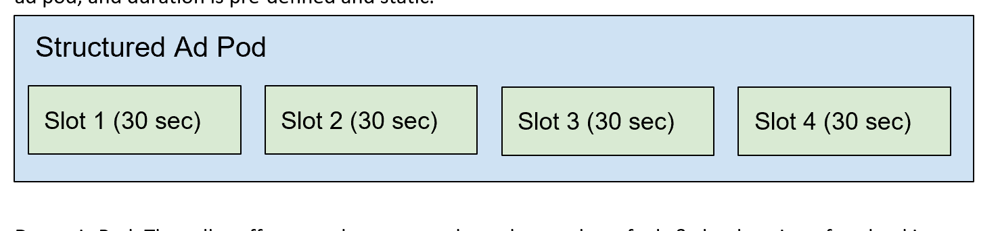
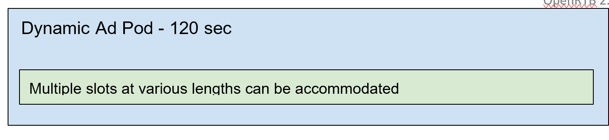
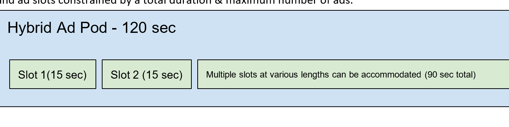

	
# 7. Implementation Notes <a name="implementationnotes"></a>
	
The following section will provide brief notes on how certain objects and fields are to be interpreted and implemented.
	
## 7.1 - No-Bid Signaling <a name="nobidsignaling"></a>
	
This section covers best practices for using the optional no-bid signaling. See the [List: No-Bid Reason Codes](https://github.com/InteractiveAdvertisingBureau/openrtb/blob/master/OpenRTB%20v3.0%20FINAL.md#list--no-bid-reason-codes-) in OpenRTB 3.0 for the enumerated list of no-bid reason codes.
	
Many exchanges support multiple response types as a no-bid:
	
- HTTP 204 “No Content” from the bidder (*most economical in terms of bandwidth*).
- An empty JSON object:<br>
 	```javascript
	{}
	```
- A well-formed no bid response:<br>
 	```javascript
	{"id": "1234567890", "seatbid": []}
	```
- A well-formed no bid response with a reason code:<br>
 	```javascript
	{"id": "1234567890", "seatbid": [], "nbr": 2}
	```
	
An important issue in RTB is when impressions are triggered by software robots mimicking web browsers. Such robots may be implicitly or explicitly driving these false transactions. The following represents a set of symmetric best practices for exchanges and bidders to help recognize and reject these events.
	
*Responsibility of the exchange*
	
Make best effort to classify and reject non-human traffic (NHT) requests for ads to the exchange via the following best practices:
	
- (Recommended) Filter impressions from known spiders via user-agent classification.
- (Recommended) Filter impressions from suspected NHT via a “detector”.
	
*Responsibility of the bidder*
	
- (Recommended) no-bid impressions from known spiders via user-agent classification.
- (Recommended) no-bid impressions from suspected NHT via a “detector”.
- Specify a no-bid reason code in either case.
	
*Where:*
	
- For exchanges, filtering the impression means that the exchange should respond to the “ad call” with either a blank HTTP 204 response or an unpaid ad (PSA) and not offered to any bidders.
- For bidders, filtering the impression means that the bidder should respond with a no-bid.
- For both exchanges and bidders, the impression transaction records should be clearly marked in any logging systems and be removed from contributing to any event counts associated with planning, forecasting, and reporting systems.
	
## 7.2 - Impression Expiration <a name="impressionexpiration"></a>
	
Recapping the typical impression flow through RTB, an ad will be requested by a client (e.g., web browser, mobile app or an SDK therein) possibly through other server intermediaries, and ultimately to the RTB exchange. The exchange conducts an auction among buyers who bid with a proposed price, possibly markup for use if the bid wins (markup can also be delivered on the win notice itself), and other metadata about the bid. The exchange then selects a winner, issues a win notice to the winning bidder, and passes the markup back to the client.
	
Winning the auction, however, does not guarantee that the ad will be successfully delivered to the client or that it will meet viewability expectations. Furthermore, policies vary among exchanges as to the criteria for billing. Most consider an ad billable upon some form of delivery or rendering vs. the auction win alone. This aligns better with the buyer’s obvious goal of ensuring that the impressions they pay for are actually displayed.
	
Some exchanges attempt to facilitate this alignment by placing the win notice in the winning ad markup so that it can serve as both a win notice and rendering notice. This is neither endorsed nor prohibited by OpenRTB except that it precludes the exchange from accepting markup on the win notice return as described in [Section 4.2.1](2.6.md#objectbidresponse). Similarly, many buyers use their own tracking URL placed within their ad markup to signal rendering independent of the OpenRTB auction win notice. In video specifically, VAST supports an impression tracking URL that is often used for billing and is always distinct from the auction win notice.
	
To abstract the concept, let us refer to “*billing notice*” as the firing of some notification URL at the time when the clearing price of the impression will be booked as spend. This is irrespective of whether the actual OpenRTB win notice URL is delegated to the client for firing or some other tracking URL is used.
	
For buyers, this billing notice is used to book progress toward spend goals and frequency caps and drive pacing algorithms. When the billing notice is delayed significantly, these critical functions can be seriously impaired. There are legitimate reasons for some delays such as caching. A common scenario is a video interstitial impression in a mobile app. Refining the example, consider a game where the video is prefetched during game play so that it can be shown after the current game level ends. This is important for the user experience but can delay the rendering of the ad for many minutes.
	
Bidders are strongly advised to track the time between the auction and the win and/or billing notices to ensure reasonable delays. If unreasonable delays are encountered frequently, bidders may elect to ignore such events and bring them to the attention of the exchange for resolution. Unfortunately, the sequence from ad request through the auction and finally to rendering and billing is fundamentally not transactional. There are simply too many parties, policies, and technologies involved and thus a good support relationship between exchange and buyer is still important.
	
The OpenRTB protocol does provide some real-time assistance, however. The `imp.exp` attribute ([Section 3.2.4](2.6.md#objectimp)) in the bid request allows an exchange to provide guidance to bidders of the number of seconds that may elapse between the auction and the billing event. As usual, omitted means unknown. Bidders can then decide if they want to bid understanding the likely delay. Bidders are advised, however, to interpret this as guidance as opposed to a contract unless the exchange expresses otherwise since exchanges are not always in a position to make hard guarantees (e.g., the SDK within the client app may not be under the exchange’s control).
	
Similarly, the `bid.exp` attribute ([Section 4.2.3](2.6.md#objectbid)) in the bid response allows the bidder to express the maximum number of seconds they are willing to tolerate between auction and billing notice. This allow the exchange to drop bids with expiration constraints it believes are likely to be violated. Bidders should not assume that a delayed billing notice greater than their specified bid expirations will not be billable. That is a policy and contract discussion between bidder and exchange and not imposed by OpenRTB.
	
The following expiration times are offered as examples of reasonable delays based on the nature of the impression. These are only provided as rules of thumb. A more data-driven method of determining these times in specific situations is highly recommended.
<table>
  <tr>
	  <td>Desktop and mobile web browsers</td><td>1 Minute</td></tr>
	<tr>
		<td>Mobile app banner ads that may be cached</td><td>5 Minutes</td></tr>
	<tr> 
		<td>Mobile app native ads that may be cached</td><td>10 Minutes</td></tr>
	<tr>  
		<td>Mobile and video interstitials</td><td>30 Minutes (or even longer)</td></tr>
	<tr>
		<td>Audio or video with server-side stitching</td><td>Very Long or Unknown</td></tr>
	</table>
	
## 7.3 - PMP & Direct Deals <a name="pmpanddirectdeals"></a>
	
**Best Practice Bidding Logic**
	
Receive request and parse;<br>
Create empty bid list for response;<br>
If request contains the `impression[].pmp` object; match bids against each `pmp.deals[]`;<br>
enforce targeting for dealID and seatID; append best M matching bids to response;<br>
If `pmp.private_auction` = False;<br>
match open auction bids against the request; append top N bids by price to response;<br>
Return response list to exchange;<br>
	
*Recommendations*
- M >= 1, preferably one per matching Deal ID.
- N >= 2 to assist with blocking rate issues.
- Minimum viable is “1+1” bidding.
- Ideal is “M+N” bidding.
	
**Warning**
	
Returning only one bid when both Deal ID and open auction bids are valid creates problems. The exchange side may be configured by a publisher to prioritize all Deal ID bids above open auction bids, or to force a price auction between them with different floors by class of bid. There are multiple common practices that depend on how the publisher prefers to sell inventory with Deal ID.
	
**Policy Recommendations**
	
- A Deal ID should be utilized for any situation where the auction may be awarded to a bid not on the basis of price alone. Any prioritization of bids other than by price should have a Deal ID.
- A Deal ID is recommended for all situations where a preferential floor may be assigned to a seat entity.
	
**Anti-Patterns**
	
The below is a set of anti-patterns that OpenRTB supporting platforms have observed in various attempts to implement Deal ID bidding logic.
	
**Subjecting Deal ID Bids to an internal auction on price**
	
The ideal bidding logic describes a process of being liberal about sending bids. Deal ID bids may not be subject to a classic price auction. There may be an expectation that the buyer and seller want prioritization to achieve a larger objective: complete delivery of the Deal represented by the Deal ID. Thus any bidding logic that sorts Deal ID bids by price (with or without open marketplace bids) and truncates the list too aggressively can endanger the fulfillment of the Deal.
	
**Associating Deal ID to the wrong Object**
	
A Deal ID should be treated as a “targeting token” associated to orders, line-items or campaigns. If the Deal ID is associated to a Seat/Buyer it may create an undesired application of the Deal ID too many active campaigns. Alternatively if it is associated to the Advertiser it may limit that entity to only a single Deal ID.
	
**Improper Handling of the Private vs Open Market Flag**
	
The `pmp.private_auction` flag indicates that the seller is willing or not willing to accept open market bids (i.e., “all bidders are welcome”). If this flag is not read and interpreted correctly, bid responses may be invalid. Open market bids sent to a private impression auction may be rejected and should not have been exposed to all bidders.
	
**Improper handling of Seat IDs**
	
If Seat IDs are treated as a filter of eligible demand partners on an open market impression, this defeats the “all bidders are welcome” intention.
	
**Silently Applying Margin Discounts to Deal ID Bids**
	
With Deal ID buyers are sellers are communicating directly. The Exchange and Bidder become third- party automation platforms. If there are any automatic or silent discounts of bid prices (based upon margins or fees) set by either the exchange or the bidder, then the Deal may fail to function correctly.
	
**Use cases**
	
*Case-1: Open Trading Agreement with Buyer*
	
- Between publisher and buying entity.
- Publisher sets an access rule defining the price floor for a specific buyer.
- Locked to the buyer.
- Broadcast price floor.
- Public/open inventory.
- No Deal ID needed (Deal ID is optional).
- No named advertiser(s).
- No prioritization of bids.
- Daily total or frequency caps optional on publisher/exchange side.
- All placements or limited to specific placements.
- Targeting is up to the buyer/bidder.
	
*Case-2: Open Trading Agreement with Buyer with Named Advertisers*
	
- As Case-1 with a list of named advertisers.
	
*Case-3: Open Bidding with Deal ID as Value-added Markers*
	
- Between publisher and buying entity.
- Publisher sets a price floor for URL masked inventory.
- Public/open inventory (i.e., all buyers welcome).
- Deal ID represents “Package Tokens”.
- Each Deal ID signals that the impression falls into various content and placement categories.
- Floor is associated to each Deal ID to signal cost for usage of that token.
- Winner is decided by bid price.
- Execution of targeting is up to the buyer/bidder.
	
*Case-4: First Look Trading Agreement*
	
- Between publisher and buying entity.
- Publisher sets an access rule defining the price floor for the buyer.
- Locked to the buyer.
- Known price floor.
- Deal ID needed.
- Optional named advertiser list.
- Prioritization of bids expected.
- Daily total or frequency caps optional on publisher/exchange side.
- All placements or limited to specific placements.
- Targeting is up to the buyer/bidder.
	
*Case-5: Direct Option Deal with Advertiser via RTB*
	
- Between Publisher and Advertiser or their representative.
- Publisher sets a rule defining a price floor and prioritization for specific advertiser(s).
- Fill rate is expected to be greater than or equal to X%.
- Locked to the buyer.
- Private/exclusive inventory.
- Limited to a set list of advertiser names (generally variants of one name).
- Known price floor.
- Deal ID needed.
- Prioritization of bids expected.
- Daily total or frequency caps will apply on bidder side; optional on Exchange side.
- Limited to specific placements.
- Targeting is mostly enforced by buyer/bidder.
	
*Case-6: Direct Option Deal with Advertiser via RTB with Private Data*
	
- Same as Case-4.
- Deal ID represents some combination of private first-party data from the Publisher.
	
*Case-7: Full-Fill Direct Deal with Advertiser via RTB*
	
- Same as Case-4.
- Fill rate is expected to be 100% or nearly so.
	
*Case-8: Full-Fill Direct Deal with Advertiser via RTB with Private Data*
	
- Same as Case-6.
- Deal ID represents some combination of private first-party data from the Publisher.
	
## 7.4 - Skippability <a name="skippability"></a>
	
This section clarifies the common use cases related to declaring skippability of video creatives.
	
Under most circumstances for RTB transactions, publishers and exchanges prefer to control the ability to skip the ad. OpenRTB therefore assumes by default that a standard linear video ad can be used as the
response to a skippable request and the ability to skip the ad will be provided by the supplier’s player automatically.
	
The presence of the `video.skip` attribute in the bid request with a value of “1” should be assumed to mean that the publisher will impose a skip button on the ad. The absence of the `video.skip` attribute should be assumed to mean that it is unknown whether the publisher will impose a skip button.
	
DSPs should confirm with publishers whether it is permissible to respond with ads that provide their own skip functionality (e.g., using VPAID to render a skip button). If bidding with such an ad and only if doing so, the bid must indicate creative attribute “16” using the `attr` array in the bid response.

*<b>NOTE</b>: VAST 4.0 separates VPAID interactivity from the media file so this is deprecated and only applies to earlier versions of VAST*
	
Some examples of these concepts follow:
	
**Bid Request**
	
*Case-1: Skippable after N Seconds for All Creatives*
	
In this case, the publisher will impose skippability. All ads will be skippable, but only after 5 seconds of play. Creatives with a total duration of 5 seconds or less would not be skippable since they would never reach this threshold.
	
```javascript
"video": {
	
..., 
 "skip": 1, 
 "skipafter": 5, 
 ...
	
}
```
	
*Case-2: Skippable after N Seconds for Minimum Duration Creatives*
	
In this case, the publisher will impose skippability. However, only creatives with a total duration greater than 15 seconds will be skippable. For ads that satisfy this minimum total duration, skippability is enabled after 5 seconds of play. Note that although these values are integers, they will compare as precise values with actual video durations. For example, a video with duration 15.1 seconds does satisfy a `skipmin` value of 15 (i.e., think of the `skipmin` value as being 15.0).
	
```javascript
"video": {
	
...,
"skip": 1, 
"skipmin": 15, 
"skipafter": 5, 
...
	}
```
	
*Case-3: Non-Skippable unless Requested by the Ad Markup*
	
In this case, the publisher will not impose skippability. Ads will only be skippable if requested by the ad markup. This is supported by VPAID and VAST 3.0, for example.
	
```javascript
"video": {
	
...,
"skip": 0, 
...
	
}
```
	
*Case-4: Unknown Skippability*
	
In this case, the `skip` attribute is omitted which indicates that exchange does not know if skippability will be imposed by the publisher. This may be the case, for example, when the exchange is not an SSP and thus may not have control or full knowledge of the publisher’s intentions.
	
**Bid Response**
	
Consider Case-3 above, where the publisher does not impose skippability. If the ad markup itself will request skippability (e.g., via VPAID or VAST 3.0), then the bid must signal this intention. This is accomplished by including creative attribute 16 (i.e., Skippable) in the bid as shown below. If the markup is not going to request skippability, then this creative attribute should not be indicated.
	
When responding to Case-3 with this skippable attribute specified in the bid, the publisher should provide skippability either by instructing the VAST 3.0 player to activate skippability (refer to the VAST
3.0 `skipoffset` attribute) or by allowing the ad to render its own skip button using VPAID.
	
```javascript
"bid": {
	
..., 
"attr": [16], 
...
	
}
```
	
In Case-1 and Case-2 where the publisher may impose its own skippability, creative attribute 16 should not be specified. Furthermore, publishers are advised to filter responses containing attribute 16 since this could conflict with the skip button rendered by the publisher. When using a VAST 3.0 response, publishers may choose to implement support for VAST 3.0 `skipoffset` at their discretion and ads should be assumed to play non-skippable if the player does not support it.
	
## 7.5 - Regs Resources <a name="regsresources"></a>
	
The regs object contains any legal, governmental, or industry regulations that the sender deem applicable to the request.
	
Please see the below resources for more details and framework specifications should you choose to implement them:
	
**<a href="https://github.com/InteractiveAdvertisingBureau/GDPR-Transparency-and-Consent-Framework">GDPR (General Data Protection Regulation)</a>**


**<a href="https://github.com/InteractiveAdvertisingBureau/USPrivacy">CCPA (California Consumer Privacy Act)</a>**


## 7.6 - Pod Bidding for Video and Audio <a name="podbidding"></a>
	
Starting in version 2.6, OpenRTB now supports ‘pod bidding’ for video and audio content streams.
An ad pod is the term describing an ad break of the type you’d see in a TV-like viewing experience or hear on a radio stream. An ad pod typically contains one or more in-stream creative assets that play out contiguously within a stream of video or audio content. Ad podding features in OpenRTB 2.6 build on capabilities in previous versions for including multiple ad requests within a single bid request object to indicate those ad requests are in some way related. Pod bidding signals communicate additional information about the pod & impression opportunities within the pod such as the sequence of the ad impressions, total pod length, maximum # of ads within a pod, multiple pod associations, and more.
	
**Terminology**
	
Ad Slot: Space for an individual ad impression within a pod.
	
Structured Pod: The seller offers a fully defined pod structure; the number of ad slots, their slot in the ad pod, and duration is pre-defined and static.


	
Dynamic Pod: The seller offers a pod structure where the number of ads & the duration of each ad in the break is indeterminate, but the total duration and maximum number of ads are constrained. In other words, the total duration of the pod is known, but the number and durations of the individual ads within the break may not be defined ahead of time. This allows bidders more flexibility to optimize their selection of ads across the demand on their platform.
	

	
Hybrid Pod: The seller offers a pod structure containing BOTH structured and dynamic components. In other words, the ad pod is composed of some combination of ad slots with predetermined durations, and ad slots constrained by a total duration & maximum number of ads.



**Recommendations**
	
- Sellers should only indicate a `slotinpod` of 1, 2, or -1 if they can absolutely guarantee placement of an ad within the first or last slot of an ad pod.
- Buyers should only indicate a `slotinpod` in response to a dynamic pod segment, including a dynamic component of a hybrid pod, if they only want to buy the first or last ad slot specifically
- Note that buyers should *only* return a `slotinpod` value in response to a Dynamic portion of a pod.
- Buyers should avoid using the `slotinpod` attribute in bid responses for structured pods, or the structured components of hybrid pods, because the `impid` field already uniquely identifies the ad slot.
- Buyers should look for `mincpmpersec` when available, otherwise fall back to `bidfloor`
- Sellers should include either the required durations (`rqddurs`) attribute, communicating exact durations, OR the `maxduration` & `minduration` attributes, but not both.
- Sellers are encouraged to include the `maxseq` attribute when offering a dynamic pod with a pod duration
- Sellers are encouraged to offer dynamic pods when possible to allow bidders to source the most optimal demand from their platforms
- Buyers should expect that final pod construction is done by the seller. Buyers who submit N bids for a particular pod may find that the seller selects anywhere between 0 to N of those bids to construct the pod that is shown to the user. Furthermore, the seller may co-mingle bids from other buyers in that pod.

**Pod bidding example scenarios**
	
*“Structured” Ad Pod Request/Response*
	
This scenario illustrates an example where the bid request contains 2 structured ad pods, and the response corresponds to the first positions in each of the 2 signaled pods.
	
```javascript
BidRequest
	
{ "imp": 
	
	[{ "id": "1", 
	
	"video": { 
	
		"podid": "pod_1", 
	
		"podseq”: 1, 
	
		"slotinpod": 1, 
	
		"mimes": [ 
	
			"video/mp4", 
	
			"video/ogg", 
	
			"video/webm" 
	
		], 
	
		"linearity": 1, 
	
		"maxduration": 60, 
	
		"minduration": 0, 
	
		... 
	
	}, 
	"exp": 7200, 
	
	"bidfloor": 8, 
	
	"bidfloorcur": "USD", 
	
	}, 
	
	{ 
	
		"id": "2", 
	
		"video": { 
	
			"podid": "pod_1", 
	
			"podseq": 1, 
	
			"slotinpod": 0, 
	
			"mimes": [ 
			
				"video/mp4", 
	
				"video/ogg", 
	
				"video/webm" 
			], 
			"linearity": 1, 
			
			"maxduration": 30, 
	
			"minduration": 0, 
	
			... 
	
		}, 
	
		"exp": 7200, 
	
		"bidfloor": 8, 
	
		"bidfloorcur": "USD", 
	
		...
	
	}, 
	
	{ 
	
		"id": "3", 
	
		"video": { 
	
			"podid": "pod_2", 
	
			"podseq": 0, 
	
			"slotinpod": 1, 
	
			"mimes": [ 
	
				"video/mp4", 
	
				"video/ogg", "
	
				video/webm" 
	
			], 
	
			"linearity": 1, 
	
			"maxduration": 30, 
	
			"minduration": 0, 
	
			... 
	
		}, 
	
		"exp": 7200, 
	
		"bidfloor": 8, 
	
		"bidfloorcur": "USD", 
	
		... 
	
		}, 
	
		{ 
	
			"id": "4", 
	
			"video": { 
	
				"podid": "pod_2", 
	
				"podseq": 0, 
	
				"slotinpod": 0, 
	
				"mimes": [ 
	
					"video/mp4", 
	
					"video/ogg", 
	
					"video/webm" 
	
				], 
	
				"linearity": 1, 
	
				"maxduration": 60, 
	
				"minduration": 0, 
	
				... 
	
			},
	
			"exp": 7200, 
	
			"bidfloor": 8, 
	
			"bidfloorcur": "USD", 
	
			... 
	
		} 
	
	], 
	
	... 
	
}
```
	
	
```javascript
BidResponse
	
{ 
	"id": "9b9ee818a85d948d5231ffe839a9729a", 
	
	"seatbid": [{ 
	
		"bid": [{
	
			"id": "1", 
	
			"impid": "1", 
	
			"price": 0.27, 
	
			"adid": "123456", 
	
			"adm": "<?xml version=\"1.0\" encoding=\"UTF-8\"?><VAST version=\"2.0\"> ...", 
	
			"adomain": [ 
	
				"advertiserA.com" 
	
			], 
	
			"cid": "456789", 
	
			"crid": "123456", 
	
			"dur": 30 
	
		}], 
	
		"seat": "1"
	
	}, 
	
	{ 
	
		"bid": [{ 
	
			"id": "2", 
	
			"impid": "3", 
	
			"price": 0.27, 
	
			"adid": "234567", 
	
			"adm": "<?xml version=\"1.0\" encoding=\"UTF-8\"?><VAST version=\"2.0\"> ...", 
	
			"adomain": [ 
	
				"advertiserB.com" 
	
			], 
	
			"cid": "567890", 
	
			"crid": "234567", 
	
			"dur": 15 
	
		}], 
	
		"seat": "2" 
	
	} 
	
	], "cur": "USD" }
	
```
	
	
*“Dynamic” Ad Pod Request/Response*
	
This scenario illustrates an example where the bid request contains 1 dynamic pod, the publisher can guarantee delivery against the first or last slot, and the response contains 3 bids from 3 different advertisers, for the signalled pod. The first bid in the response is only eligible for the first position in the pod.
	
```javascript
BidRequest

{

	"imp": [{
	
		"id": "1",
		
		"video": {
		
			"podid": "preroll_pod",
			
			"mimes": [
			
				"video/mp4",
				
				"video/ogg",
				
				"video/webm"
				
			],
			
			"linearity": 1,
			
			"maxduration": 60,
			
			"minduration": 0,
			
			"maxseq": 4,
			
			"poddur": 60,
			
			"slotinpod": 2,
			
			...
			
		},
		
		"exp": 7200,
		
		"bidfloor": 8,
		
		"bidfloorcur": "USD",
		
		...
		
	}],
	
	...
	
}
```


```javascript
BidResponse

{

	"id": "9b9ee818a85d948d5231ffe839a9729a",
	
	"seatbid": [{
	
			"bid": [{
			
				"id": "1",
				
				"impid": "1",
				
				"price": 0.27,
				
				"adid": "123456",
				
				"adm": "<?xml version=\"1.0\" encoding=\"UTF-8\"?><VAST version=\"2.0\"> ...",
				
				"adomain": [
				
					"advertiserA.com"
					
				],
				
				"cid": "456789",
				
				"crid": "123456",
				
				"slotinpod": 1,
				
				"dur": 30
				
			}],
			
			"seat": "1"
			
		},
		
		{
		
			"bid": [{
			
				"id": "2",
				
				"impid": "1",
				
				"price": 0.27,
				
				"adid": "234567",
				
				"adm": "<?xml version=\"1.0\" encoding=\"UTF-8\"?><VAST version=\"2.0\"> ...",
				
				"adomain": [
				
					"advertiserB.com"
					
				],
				
				"cid": "567890",
				
				"crid": "234567",
				
				"dur": 15
				
			}],
			
			"seat": "1"
			
		},
		
		{
		
			"bid": [{
			
				"id": "3",
				
				"impid": "1",
				
				"price": 0.27,
				
				"adid": "345678",
				
				"adm": "<?xml version=\"1.0\" encoding=\"UTF-8\"?><VAST version=\"2.0\"> ...",
				
				"adomain": [
				
					"advertiserC.com"
					
				],
				
				"cid": "678901",
				
				"crid": "345678",
				
				"dur": 15
				
			}],
			
			"seat": "2"
			
		}
		
	],
	
	"cur": "USD"
	
}
```

	
	
*“Hybrid” Ad Pod Request/Response*
	
This scenario illustrates an example where the bid request contains slot 1 in the first impression object and a dynamic pod to fill the duration. The response contains 3 bids from 3 different advertisers, for the signalled pod. The first bid in the response is only eligible for the first position in the pod and the second two responses would be to fill the remainder of the pod.
	

```javascript
BidRequest

{

	"imp": [{
	
			"id": "1",
			
			"video": {
			
				"podid": "pod_1",
				
				"slotinpod": 1,
				
				"mimes": [
				
					"video/mp4",
					
					"video/ogg",
					
					"video/webm"
					
				],
				
				"linearity": 1,
				
				"maxduration": 15,
				
				"minduration": 15,
				
				...
				
			},
			
			"exp": 7200,
			
			"bidfloor": 15,
			
			"bidfloorcur": "USD",
			
			...
			
		},
		
		{
		
			"id": "2",
			
			"video": {
			
				"podid": "pod_1",
				
	"slotinpod": 0,
	
				"mimes": [
				
					"video/mp4",
					
					"video/ogg",
					
					"video/webm"
					
				],
				
				"linearity": 1,
				
				"maxduration": 60,
				
				"minduration": 0,
				
				"maxseq": 4,
				
				"poddur": 60,
				
	                             ...
				     
			},
			
			"exp": 7200,
			
			"bidfloor": 8,
			
			"bidfloorcur": "USD",
			
			...
			
		}
		
	}],
	
	...
	
}
```

```javascript
BidResponse

{

	"id": "9b9ee818a85d948d5231ffe839a9729a",
	
	"seatbid": [{
	
			"bid": [{
			
				"id": "1",
				
				"impid": "1",
				
				"price": 20.27,
				
				"adid": "123456",
				
				"adm": "<?xml version=\"1.0\" encoding=\"UTF-8\"?><VAST version=\"2.0\"> ...",
				
				"adomain": [
				
					"advertiserA.com"
					
				],
				
				"cid": "456789",
				
				"crid": "123456",
				
				"dur": 15
				
			}],
			
			"seat": "1"
			
		},
		
		{
		
			"bid": [{
			
				"id": "2",
				
				"podid": "pod_1",	
				
				"impid": "2",
				
				"price": 9.27,
				
				"adid": "234567",
				
				"adm": "<?xml version=\"1.0\" encoding=\"UTF-8\"?><VAST version=\"2.0\"> ...",
				
				"adomain": [
				
					"advertiserB.com"
					
				],
				
				"cid": "567890",
				
				"crid": "234567",
				
				"dur": 15
				
			}],
			
			"seat": "1"
			
		},
		
		{
		
			"bid": [{
			
				"id": "3",
				
				"podid": "pod_1",
				
				"impid": "2",
				
				"price": 10.27,
				
				"adid": "345678",
				
				"adm": "<?xml version=\"1.0\" encoding=\"UTF-8\"?><VAST version=\"2.0\"> ...",
				
				"adomain": [
				
					"advertiserC.com"
					
				],
				
				"cid": "678901",
				
				"crid": "345678",
				
				"dur": 15
				
			}],
			
			"seat": "2"
			
		}
		
	],
	
	"cur": "USD"
	
}
```

	
	
## 7.7 - Network vs Channel Example Cases <a name="networkandchannel"></a>
	
Starting in version 2.6, OpenRTB now supports Network and Channel objects. See [3.2.23](2.6.md#objectnetwork) and [3.2.24](2.6.md#objectchannel) for details).While these examples are straight forward for traditional linear television, the options for CTV consumption warrant a few examples.
	
*Example 1*: A user viewing content on an internet connected device, on an app with multiple channel options (e.g. Discovery+ App > HGTV Channel/show)
	
- Discovery is the Network
- HGTV is the Channel
	
*Example 2*: A user viewing content on an internet connected device, on an app that streams content directly (Roku > Hulu > Hulu Original show)
	
- Hulu is the network (also identified by `bundle`)
- Hulu is the channel
	
 *Example 3*: A user viewing content on an internet connected device, on a device offered channel (Roku > Fubo > Comedy Central show)
	
- Roku is the device
- FuboTV is the network (also identified by `bundle`)
- Comedy Central is the channel
	
*Example 4*: A user is viewing content on an internet connected device, on a device offered channel that licenses content (Samsung TV > Pluto > Pluto TV Spotlight)
	
- Samsung TV is the device
- Pluto is the network (also identified by `bundle`)
- PlutoTV Spotlight is the channel
	
## 7.8 - Counting Billable Events and Tracked Ads <a name="counting"></a>
	
There are multiple conventions for how to count billable events or tracked ads via OpenRTB, typically an impression or other such common metric. This section outlines the common ones, addresses common mistakes, and offers a comparison of the approaches.
	
This section addresses technical methods available for implementers to consume these events. These events have specific business definitions and criteria for counting eligibility set by the Media Rating Council, and implementers should also consult the[ Media Rating Council’s guidelines](https://mediaratingcouncil.org/standards-and-guidelines).
	
Implementers should discuss the definition of the billable event and the technical basis for counting it with their counterparties to determine a mutually acceptable approach.
	
**Overview of counting methodologies**
	
	
<table>
  <tr>
    <td><strong>Method</strong></td>
    <td><strong>Remarks</strong></td>
  </tr>
  <tr>
    <td>Pixel in Markup</td>
    <td>- Widely supported<br>
	- Normally fired from client-side browser<br>
	- Prone to discrepancies<br>
	- May overcount in some circumstances (i.e. mobile app)<br>
	- Only applicable for display</td>
  </tr>
  <tr>
    <td>VAST <impression> event</td>
    <td>- Recommended for audio/video<br>
	- Only applicable for audio/video</td>
 </tr>
  <tr>
    <td>Billing notice ("burl")</td>
    <td>- Best alignment between DSPs and exchanges to count tracked ads<br>
	- Minimal discrepancy<br>
	- Not recommended for audio/video, otherwise applicable to all creative types<br>
	- Usually (and recommended to be) fired server-to-server, but based on an initial client-side event</td>
</tr>
  <tr>
    <td>Native eventtrackers/imptrackers/jstrackers</td>
    <td>- Only applicable to native ads</td>
  </tr>
</table>
	
	
**Pixel in markup (banner ads)**
	
This is the original convention for counting impressions/tracked ads; in this method, the OpenRTB specification itself does not address how to receive the events. The bidder self-embeds a tracking pixel in their HTML markup (i.e. an  tag which makes a request to the bidder’s servers). When the client device loads the markup, it fires the pixel.
	
For banner ads on web, this is a widely adopted approach to counting billable events/tracked ads, however some circumstances arise in which there may be discrepancies. Differences in timing between when an exchange’s and a DSP’s pixel load may result in discrepancies, and the noisy nature of the public Internet and variable connectivity quality of client devices may result in one pixel firing but not the other. Additionally, this method does not address certain scenarios well, namely:
	
- **Mobile apps** – a billable event may only be counted when the ad is displayed. In mobile apps, the markup is often fetched well in advance of being displayed to buffer against slow and unreliable connections. The markup may never be displayed if the user abandons the app before the ad is displayed – especially for interstitials.
	
- **Creative auditing** – markup may be loaded to scan for malvertising, etc., which may generate spurious extra billable/tracked ad events, including for unwon auctions.
	
**BEST PRACTICE**: When it is possible to do so, exchanges should avoid using adm-based notifications as the determinant for billing events in the mobile app context, and instead use burl or an independent measurement approach (e.g. OMID), that is predicated upon an ad actually being displayed to the user.
	
**VAST <Impression> event (video/audio)**
	
The VAST specification includes a provision for <Impression> objects, which demand chain participants can use to request notifications when a billable event has occurred. The IAB prescribes that for video, the VAST <Impression> event is the official signal that the billable event has occurred.
	
Demand chain participants are discouraged from using billing notice URLs (burl) for video/audio transactions.
	
**Billing notice (“burl”)**
	
Billing notice support was introduced in OpenRTB 2.5. In this scenario, **outside** of the ad markup itself, a “billing notice URL” is included in the bid response. A billing event is when a transaction results in a monetary charge from the publisher to an exchange, and subsequently from the exchange or other intermediary to one of their demand-side partners. This event is subject to publisher and exchange-specific business policies that should be conveyed clearly to their partners. For a DSP, this event signals that they can increment spend and deduct the remaining budget against the related campaign. The exchange conveys this event by invoking the URL provided by the demand source in the bid.burl attribute.
	
**BEST PRACTICE**: Firing the billing notice URL represents the fulfillment of a business transaction between a publisher and an exchange, or between the exchange and its demand partner. This should not be delegated to another party including a client-side pixel, although a pixel may be the initiating signal for billing to the exchange.
	
**BEST PRACTICE**: Exchanges, upon determining that a billable event has occurred (e.g., receipt of client-initiated billable event), and in order to minimize discrepancies between themselves and their demand sources, should invoke the billing notice from the server-side. This should be done as "close" as possible to the moment when the exchange books revenue. See the below section regarding best practices for server-side billing notifications.
	
**BEST PRACTICE**: Exchanges are highly encouraged to standardize on a client-initiated render or viewability event as the basis for the billing event. This is generally the most consistent approach in a complex supply chain scenario composed of multiple auction decision points.
	
**BEST PRACTICE**: Publishers should generally refer to the [Media Rating Council’s guidelines](https://mediaratingcouncil.org/standards-and-guidelines) to determine when the criteria have been met to consider a transaction billable.
	
**BEST PRACTICE**: The public internet is noisy and this event is financial in nature. If an entity calling a billing notice receives a response other than HTTP 200 or 204, it should consider a retry scheme (e.g., every 10 seconds for the next minute). Conversely, an entity receiving billing notices should endeavor to make their endpoint idempotent to avoid double counting.
	
**BEST PRACTICE**: When it is possible to do so, exchanges should avoid using adm-based notifications as the determinant for billing events in the mobile app context, and instead use burl or an independent measurement approach (e.g. OMID), that is predicated upon an ad actually being displayed to the user.
	
For VAST video/audio, if the `bid.burl` attribute is specified, it should be fired at the same time as the VAST <Impression> event. However, subtle technical issues may lead to additional discrepancies and bidders are cautioned to avoid this scenario. One option is for exchanges nearest a video supply source to use the VAST <Impression> event as their billing signal and then use the billing notice URL (burl) as described.
	
**Native eventtrackers, imptrackers, jstrackers**
	
For native ads specifically, the OpenRTB Native specification offers options for including an impression tracking URL or script to be loaded at impression time. See the [OpenRTB Native](https://iabtechlab.com/standards/openrtb-native/) spec for more information. For native video, most platforms utilize the impression events within VAST for billing and other event notifications, rather than the structured tracking options available within the native spec.
	
**Win notice (“nurl”) – not a billable or tracked ad event**
	
At first glance, an auction “win” and the associated win notice (`nurl`) field appears suitable as a proxy for billable/tracked ad counting. However, winning an auction does not guarantee that an impression will indeed be served, and in fact in many cases only a small percentage of won auctions will become impressions. This occurs because of downstream auctions (i.e. client-side header bidding), inability to play back media (in video and audio), etc.
	
**Win notice URLs should never be used to count impressions or tracked ads.**
	
### Best Practices for server-side billing notifications
	
In some cases, publishers or their vendors may choose to fire impression notifications from a server. This is very common in long-form video, which uses server-side ad insertion to coordinate the delivery and measurement of ads to a “thin” client on the user’s device. It is also common in mobile app, where the monetization SDK uses a server-side service to fire burl notifications.
	
The following best practice is derived from the [VAST 4.2 spec](https://iabtechlab.com/wp-content/uploads/2019/06/VAST_4.2_final_june26.pdf) (page 17), but recommended for any impression notification (for all formats, regardless of protocol or version).
	
**BEST PRACTICE**: When possible, exchanges are encouraged to send billing notice URL (burl) notifications from the server-side, to minimize discrepancies with demand partners. The billable event itself should originate from a client-side event per MRC guidelines.
	
**BEST PRACTICE**: When firing impression notifications via HTTP request from the server-side, the notifier should:
	
- Make use of the X-Forwarded-For or X-Device-IP HTTP header to indicate the IP address of the client device on behalf of which the notification is being sent.
- Make use of the X-Device-User-Agent HTTP header to indicate the UserAgent of the client device on behalf of which the notification is being sent.
	
These HTTP headers allow recipients of impression notifications to run anti-IVT checks using metadata about the end user device, rather than the server itself.
	
**BEST PRACTICE**: When firing impression notifications via HTTP request from the server-side, the notifier should establish an [ads.cert Call Sign](https://iabtechlab.com/wp-content/uploads/2021/09/2-ads-cert-call-signs-pc.pdf) and make use of the [ads.cert Authenticated Connections protocol](https://iabtechlab.com/wp-content/uploads/2021/09/3-ads-cert-authenticated-connections-pc.pdf) to cryptographically sign notifications. This allows recipients of impression notifications, who’ve established ads.cert Call Signs of their own, to authenticate the sender for anti-fraud purposes.
	

## 7.9 - Digital Out-Of-Home <a name="dooh"></a>

This section details the unique differences between trading the online world of digital display and real-world aspects of Digital Out-Of-Home (DOOH) media. Each sub section references the key objects that enable DOOH to be traded using the OpenRTB standard.
	
### 7.9.1 -  Multiple/Variable Impressions
The OpenRTB trading method was built around the assumption that a targeted user holds one device and is served an ad as they visit a webpage e.g. One impression = One user.
OOH Media is a medium where one advert play (a spot) is viewable by everyone who is in the vicinity of the advert being displayed e.g. One ad display = multiple viewers/users (this number can be both greater than *or* less than 1 - due to numbers being based on statistical modeling, fractional values (e.g. .32 impressions per ad display) are common. These rates are also variable as they may be based on hourly-adjusted projections, or real-time sensor data.

Multiplying by decimal values (especially with a CPM) can lead to discrepancies when the ‘buy side’ and ‘sell side’ truncate decimal places. Measures need to be taken to avoid this at an account level.
	
The OpenRTB imp object now includes a qty object that enables the multiplier dimension

### 7.9.2 Unique Device Characterisitcs
	
#### 7.9.2.1 Highly Variable Physical Size
The majority of devices that are served ads via OpenRTB are of a size that one person can hold or lean into. In OOH media the advert can be traded and served on anything from the size of a shelf edge label to the size of multiple football pitches. This far exceeds the size range of anything that can be held in the viewer's hand or hung on their living room wall.

The size and direction of an OOH display not only affects the size of the audience that could see it, but also changes the chances of the audience that will see the advertisement being served.

A common trait with both OOH and  digital display ads is that there are a wide variety of sizes, resolutions and aspect ratios to be accommodated as the physical displays ‘build into’ physical spaces vary, and may contain additional content (e.g. tickers, application, labels) that cause ad slot sizes to vary.
	

#### 7.9.2.2 Private Networks / Geo-Location Information
The majority of commercial DOOH digital displays sit on ‘walled garden’ private ip networks. This protects the displays from a wide spectrum of internet security issues, vulnerabilities and attacks.

This can lead to 3rd party ad serving, cookies and http event logging service being constricted by the ‘safe-lists’ of urls allowed through the ‘walled garden’ security. 

Many Media Owners / Publishers therefore publish proprietary ‘1st Party’ playout reports and confirmations and use ‘1st Party’ ad servers and/or CMS systems.

The use of private ip networks also means that DSPs are not able to use their normal IP address geolocation techniques to get information about where ads are delivered - though publisher-reported locations (e.g. lat/lon, geo information like address, zip, region) are almost always available. In the case of moving media (e.g. taxi-top displays, bus panels, etc.) near-real time GPS-derived information is common.

#### 7.9.2.3 Non-Persistent Connections / Longer-Than-Realtime Delays
Most DOOH display panels in urban and remote connections rely on cellular networks for their network connectivity. Whilst a Media Owner may have their own private network with a telecoms provider, the network is still at the mercy of congestion on the local cell tower. Over subscription to cell towers at peak times and locations leads to the DOOH display panels having non-persistent internet connection. 

To mitigate this, some DOOH Media Owners and/or publishers employ ‘forward and store’  technology and give a lead time tolerance from bid request to display. Bids may be requested in advance (to allow pre-buffering or populate “playlists'' on devices, and the confirmation of playback may be delayed due to log collection or processing within publisher systems 

The current industry accepted lead time from ‘bid confirmation’ to ‘display’ can be up to 1 to 2 hours.

#### 7.9.2.4 Proprietary Device Attributes
Unlike the TV, Tablet and Mobile phone market, there are no dominant global brands supplying digital OOH screen technology to the market. Media Owners and/or Publishers source their own screen technology from a wide variety of manufacturers, technologies and installation partners resulting in each network having its own proprietary device types,identifiers, and other attributes such as user agent strings.

Some countries have attempted to create standards for describing the shape, size and format of the digital units, but to date there is no recognised global standard for identifying a digital out of home device or the users who it may reach.

In the case of user agents, oftentimes non-standard strings are used by Media Owners, which has been known to plague device detection and traffic protection systems. It is advised that Media Owners comply with the HTTP user agent standards set forth by the IETF and submit their user agents to the IAB Spiders and Bots List using the "Submit here" button on this page.

#### 7.9.2.5 Key Object Attributes To Use For DOOH Device Reference in OpenRTB
Key objects such as imp.qty and dooh have been added to the OpenRTB specification to enable the programmatic trading of the medium. The following table gives guidance to the use of more common OpenRTB object references when transacting DOOH bids.

| Object Reference        | Type                | Implementation Guidance                                                                                                                                                                                                                   |
| ----------------------- | ------------------- | ----------------------------------------------------------------------------------------------------------------------------------------------------------------------------------------------------------------------------------------- |
| device.geo              | object              | Since ip may not be available, geo location  lat / lon field is required for DOOH transactions. geo.type is recommended.                                                                                                                  |
| device.devicetype       | string array        | Digital out of home devices shall be identified as type 8.                                                                                                                                                                                |
| device.ppi              | integer             | Screen dimensions in inches can be calculated using ppi, w and h.                                                                                                                                                                         |
| device.ifa              | string              | A device ID used to identify an individual out of home device. The device.ifa should not be used as a user identifier or for audience targeting purposes, but may be used for purposes like frequency capping.|
| device.ifa_type        | string              | For DOOH this is usually given as "ppid" to show this is a publisher-provided device id or "sspid" to show this is an exchange-provided device id                                                                                         |
| device.eids             | object              | Used to send additional identifiers. e.g. geopath.org or oohspace.co.uk or to signal the ifa provider. See AdCom eids                                                                                                                     |
| imp.video.boxingallowed | integer             | For DOOH, when boxingallowed = 0, the video aspect ratio should strictly match that of the placement, as determined by the video w and h fields.                                                                                          |
| imp.dt                  | float               | Timestamp when the item is estimated to be fulfilled (e.g. when a DOOH impression will be displayed) in Unix format (i.e., milliseconds since the epoch).                                                                                 |
                                                                                                             
### 7.9.3 Commercially Critical Ad Quality
One bad advert being served at one time to one person is survivable. 
One bad advert served at one time to 1000’s of people in a public place will lead to a Media Owner and/or Publisher risking their contract/permission to serve ads to networks of screens. 

All ads being served on large commercial networks need to be manually pre-approved (typically involving human, visual review) by the publisher (and in some cases other 3rd parties e.g. venue landlords) before any bids can be accepted for display.

This means typical lead times for creative approval are on the order of “working days” - though they may be expedited through operational processes. It also means many publishers and networks will prohibit creative rotation, dynamic content, or changes post-approval - pending further review. 3rd-Party AdServing (3PAS) support (and support for HTML) is possible, but not guaranteed - including limitations of variations of typical banner ads like dynamic content, animation, or DCO.

For the above reasons, use of IAB Ad Management API (https://github.com/InteractiveAdvertisingBureau/AdManagementAPI/blob/master/Ad%20Management%20API%201.0%20FINAL.md) for creative submission to DOOH exchanges is strongly recommended, though many SSPs may have proprietary extensions to allow submitting ads to specific individual publishers.


### 7.9.4 DOOH Pricing
Bid price and clearing price should be expressed as a CPM rate per impression.  
For example, if an advertiser is bidding $2.50 CPM on a 1st price auction, and the auction is for 30.3 impressions:
multiplier = 30.3 (Impression multiplier from bid request)
bid.price = 2.50 (Bid price in CPM from bid response)

If the advertiser wins, tracking URL (e.g. burl) macros will contain the following values:
${AUCTION_PRICE} = 2.50 (The clearing price of the auction)
${AUCTION_MULTIPLIER} = 30.3 (The total quantity of impressions won; for confirmation only. This should always be less than or equal to the multiplier value sent in the bid request. This value is a float value greater than zero and may be less than one.)

To calculate the total cost of the transaction:
(AUCTION_PRICE / 1000) * AUCTION_MULTIPLIER = COST
(2.50 / 1000) * 30.3 = $0.07575

The above auction would translate to an invoice of $0.07575.

	
### 7.9.5 Auction Notifications
In DOOH, there can be significant delay between winning an auction, and the creative actually being rendered. For this reason, it is strongly recommended to separate the win and billing events, following OpenRTB best practises:
- nurl - Auction event notification URL fired when a bid has won the auction. Not a guarantee that impressions will occur.
- burl - Auction event billing URL fired when the creative has rendered on screen and impression[s] are billable.

	
### 7.9.6 - DOOH Example Scenarios

#### 7.9.6.1 - DOOH Banner Bid Request

```javascript
{
    "id": "162059897743978051070",
    "at": 1,
    "imp": [
        {
            "id": "007",
            "secure": 1,
            "exp": 360,
            "bidfloor": 5.0,
            "bidfloorcur": "GBP",
            "banner": {
                "w": 1080,
                "h": 1920,
                "format": [
                    {
                        "w": 1080,
                        "h": 1920
                    },
                    {
                        "w": 720,
                        "h": 1366
                    }
                ],
                "mimes": [
                    "image/jpg",
                    "image/png",
                    "text/html"
                ]
            },
            "pmp": {
                "private_auction": 0,
                "deals": [
                    {
                        "id": "123",
                        "at": 1,
                        "bidfloor": 4.50
                    },
                    {
                        "id": "333",
                        "at": 1,
                        "bidfloor": 3.00
                    },
                    {
                        "id": "444",
                        "at": 1,
                        "bidfloor": 2.00
                    }
                ]
            },
            "dt": 12345670,
            "qty": {
                "multiplier": 14.2,
                "sourcetype": 1,
                "vendor": "route.org.uk"
            }
        }
    ],
    "device": {
        "geo": {
            "lat": 0.0001,
            "long": -0.1235,
            "lastfix": 0
        },
        "devicetype": 8,
        "w": 1080,
        "h": 1920,
        "ppi": 72,
        "ifa": "1235461904",
        "ifa_type": "ppid",
        "eids": [
            {
                "source": "oohspace.co.uk",
                "uids": [
                    {
                        "atype": 501,
                        "id": "1235461904"
                    }
                ]
            }
        ]
    },
    "dooh": {
        "content": {},
        "id": "15790",
        "keywords": "Roadside, Billboard, D96",
        "name": "This",
        "publisher": {
            "id": "G1",
            "name": "Global"
        },
        "domain": "global.com",
        "venuetax": 1,
        "venuetypeid": 30101
    },
    "cur": [
        "GBP"
    ]
}
```

#### 7.9.6.2 - Banner Bid Response

```javascript
{
	"id": "1234567890",
	"bidid": "162059897743978051070",
	"cur": "GBP",
	"seatbid": [
		{
			"seat": "512",
			"bid": [
				{
					"id": "1",
					"impid": "102",
					"price": 9.43,
					"banner": {
						"img": "http://adserver.com/creative112.jpg"
					},
					"burl": "http://adserver.com/billingnotice?impid=102& bidid=abc1123&price=${AUCTION_PRICE}&multiplier=${AUCTION_MULTIPLIER}",
					"adomain": [
						"advertiserdomain.com"
					],
					"cid": "campaign111",
					"crid": "creative112",
					"attr": [
						1,
						2,
						3,
						4,
						5,
						6,
						7,
						12
					],
					"w": 1080,
					"h": 1920,
					"cat": [
						"IAB1"
					]
				}
			]
		}
	]
}
```

#### 7.9.6.3 - DOOH Video Bid Request

```javascript
{
    "id": "873465983764395",
    "at": 1,
    "imp": [
        {
            "id": "123456",
            "secure": 1,
            "exp": 720,
            "bidfloor": 4.8,
            "bidfloorcur": "GBP",
            "video": {
                "boxingallowed": 1,
                "w": 960,
                "h": 480,
                "maxduration": 20,
                "minduration": 20,
                "mimes": [
                    "video/jpeg",
                    "video/mp4",
                    "video/mov"
                ]
            },
            "pmp": {
                "private_auction": 1,
                "deals": [
                    {
                        "id": "V123",
                        "at": 1,
                        "bidfloor": 4.50
                    }
                ]
            },
            "dt": 1647010095,
            "qty": {
                "multiplier": 14.2,
                "sourcetype": 0,
                "vendor": "route.org.uk"
            }
        }
    ],
    "device": {
        "geo": {
            "lat": 51.51112,
            "long": -0.09043,
            "lastfix": 0
        },
        "devicetype": 8,
        "w": 960,
        "h": 480,
        "ppi": 3,
        "ifa": "1234928801",
        "ifa_type": "ppid",
        "eids": [
            {
                "source": "oohspace.co.uk",
                "uids": [
                    {
                        "atype": 501,
                        "id": "1234928801"
                    }
                ]
            }
        ]
    },
    "dooh": {
        "content": {},
        "id": "1Frame",
        "keywords": "LargeFormat,CANNON STREET STN,CANNON STREET,MAIN CONCOURSE",
        "name": "Transvision",
        "publisher": {
            "id": "VJCDUK",
            "name": "viooh"
        },
        "domain": "viooh.com",
        "venuetax": 1,
        "venuetypeid": 10602
    },
    "cur": [
        "GBP"
    ]
}
```

#### 7.9.6.4 - DOOH Video Bid Response

```javascript
{
	"id": "1234567890",
	"bidid": "162059897743978051070",
	"cur": "GBP",
	"seatbid": [
		{
			"seat": "512",
			"bid": [
				{
					"id": "1",
					"impid": "102",
					"price": 9.43,
					"nurl": "http://adserver.com/winnotice?impid=102&bidid=abc1123",
					"burl": "http://adserver.com/billingnotice?impid=102&bidid=abc1123&price=${AUCTION_PRICE}&multiplier=${AUCTION_MULTIPLIER}",
					"adm": "<?xml version="1.0" encoding="UTF-8"?><VAST version="4.0"><Ad id="79ba491b-dfe1-5044-9d8e-758ae874e24f"> <InLine><AdSystem>AdServer</AdSystem><AdTitle><![CDATA[DOOH Video ad]></AdTitle><Error><![CDATA[https://adserver.com/event/error]]></Error><Impression><![CDATA[https://adserver.com/event/impression]]></Impression><Creatives> <Creative id="79ba491b-dfe1-5044-9d8e-758ae874e24f"><Linear> <Duration>00:00:10</Duration> <MediaFiles><MediaFile delivery="progressive" bitrate="8326" width="1920" height="1080" type="video/mp4" scalable="true" maintainAspectRatio="true"> <![CDATA[https://adserver.com/creative.mp4]]> </MediaFile></MediaFiles></Linear></Creative></Creatives></InLine></Ad></VAST>",
					"adomain": [
						"advertiserdomain.com"
					],
					"cid": "campaign111",
					"crid": "creative112",
					"attr": [
						1,
						2,
						3,
						4,
						5,
						6,
						7,
						12
					],
					"w": 1920,
					"h": 1080,
					"cat": [
						"IAB1"
					]
				}
			]
		}
	]
}
```

## 7.10 - Updated Video Signals <a name="videosignals"></a>
#### 7.10.1 - Examples 
#### 7.10.1.1<strong> Instream Video:</strong>
Pre-roll, mid-roll, and post-roll ads that are played before, during or after the streaming video content that the consumer has requested. Instream video must be set to “sound on” by default at player start, or have explicitly clear user intent to watch the video content. While there may be other content surrounding the player, the video content must be the focus of the user’s visit. It should remain the primary content on the page and the only video player in-view capable of audio when playing. If the player converts to floating/sticky subsequent ad calls should accurately convey the updated player size.
	

	
#### 7.10.1.2<strong> Accompanying Content:</strong>
Pre-roll, mid-roll, and post-roll ads that are played before, during, or after streaming video content. The video player loads and plays before, between, or after paragraphs of text or graphical content, and starts playing only when it enters the viewport. Accompanying content should only start playback upon entering the viewport. It may convert to a floating/sticky player as it scrolls off the page.


#### 7.10.1.3<strong> Interstitial: </strong>
Video ads that are played without video content. During playback, it must be the primary focus of the page and take up the majority of the viewport and cannot be scrolled out of view. This can be in placements like in-app video or slideshows.


#### 7.10.1.4<strong> No Content/Standalone: </strong> 
Video ads that are played without streaming video content. This can be in placements like slideshows, native feeds, in-content or sticky/floating.


#### 7.10.2 - Using plcmt attribute in Object: Video

The release of updated definitions in AdCOM List: Plcmt Subtypes – Video and a new attribute (<code>plcmt</code> in [Object: Video](2.6.md#objectvideo)) to give publishers a way to signal video inventory in a way that more closely aligns with the updated ad format guidelines without breaking existing workstreams. 

<strong> Case 1: In-stream to Instream </strong>
	
If a publisher or player would like to send both the legacy value for In-Stream and the updated definition of Instream it should send the legacy value of placement=1 using the legacy <code>placement</code> attribute and the updated value of plcmt=1 using the <code>plcmt</code> attribute attributes in the video object. 

Here is an example ad request: 

	"video": {
	“placement”: “1”
	“plcmt”: “1” 
	}
	
The presence of the <code>placement</code> attribute refers to the legacy <a href="https://github.com/InteractiveAdvertisingBureau/AdCOM/blob/master/AdCOM%20v1.0%20FINAL.md#list--placement-subtypes---video-"> List: Placement Subtypes - Video in AdCOM </a>. It describes the inventory as In-stream per that definition. The presence of the <code>plcmt</code> attribute points to the updated <a href="https://github.com/InteractiveAdvertisingBureau/AdCOM/blob/master/AdCOM%20v1.0%20FINAL.md#list--plcmt-subtypes---video-">List: Plcmt Subtypes - Video</a> and defines the same inventory as “Instream” under the updated definition. 

<strong> Case 2: In-Article to No Content/Standalone </strong>
	
If a publisher or player would like to send both the legacy value for In-Article and the updated definition of No Content/Standalone it should send the legacy value of placement=3 using the legacy <code>placement</code> attribute and the updated value of plcmt=4 using the <code>plcmt</code> attribute attributes in the video object. 

Here is an example ad request: 

	"video": {
	“placement”: “3”
	“plcmt”: “4” 
	}

## 7.11 - Guidance on the Use of Floors <a name="floors"></a>

### 7.11.1 - History of Floors Fields

In versions of OpenRTB prior to 2.6-202307, floors were provided in the `Imp` and `Deal` objects with the fields `imp.bidfloor` and `deal.bidfloor`, respectively. The initial release of OpenRTB 2.6 (PDF version, pre-GitHub) introduced the `mincpmpersec` field in the `Audio` and `Video` objects, which was the first time that floor-related information was associated with specific formats.

As of OpenRTB 2.6-202307, `mincpmpersec` was also added to the `Deal` object, to allow sellers of audio or video supply to indicate to buyers the relationship between the duration of ads and their floor price in the ad server (in recognition of the fact that in audio/video ad serving, longer duration ads are typically priced higher than shorter ones). Concurrently, a new object serving a similar purpose, known as Duration Floors (see [Object: DurFloors](2.6.md#objectdurfloors)), was added to the `Audio` and `Video` objects, as well as the `Deal` object. The purpose of Duration Floors is to allow sellers to express a nonlinear relationship between the duration of creatives and the associated floor price of the impression opportunity.

### 7.11.2 - How Sellers Should Provide Floor Guidance

Sellers may specify floors in 3 locations within a BidRequest:
- `Imp` (via `imp.bidfloor`)
- `Video` or `Audio` (via `video.mincpmpersec` or `video.durfloors`, or `audio.mincpmpersec` or `audio.durfloors`)
- `Deal` (via `deal.bidfloor` or `deal.mincpmpersec` or `deal.durfloors`)

In the `Video` and `Audio` objects, sellers must only include one form of floor guidance. In other words, a seller should either provide `mincpmpersec` or `durfloors`. Similarly, in the `Deal` object, a seller should either provide `mincpmpersec` or `durfloors` or `bidfloor`.

### 7.11.2 - How Buyers Should Interpret Floor Guidance

Buyers bidding with a specific Deal ID should use the floor guidance provided in the corresponding `Deal` object. If there is no floor guidance in the `Deal` object or the buyer is bidding on an Open Market impression opportunity, the buyer should use the floor guidance provided in the corresponding `Video` or `Audio` object to inform their bids. Finally, if no floors are provided in the `Video` or `Audio` objects or the buyer is bidding on a Native or Banner impression opportunity, the buyer should use the floor guidance provided in the `Imp` object.

## 7.12 - ID Match Method Guidance <a name="idmm"></a>

### 7.12.1 - Best Practices for Disclosing ID Matches
Unless prior arrangements have been made between the buyer and the seller directly, the value in the <code>user.buyeruid</code> field is expected to be derived from a real time cookie sync (see [Appendix: Cookie Syncing](https://github.com/openrtb2.x/blob/main/2.6.md#appendix-c-cookie-based-id-syncing-) and value in <code>device.ifa</code> field is expected to be derived from an advertising ID call to the Operating System. 

For an Exchange to properly disclose that an ID substitution has occurred by a publisher, they must propagate the <code>mm</code> value, as sent by the publisher, on the Extended Identifier (eid) they send to the DSP, regardless of how the SSP determined the DSP’s ID.

If a linkage is made by any party (e.g. a SSP to a DSP cookie ID) based on an incoming EID where <code>mm</code> does not equal 1 or 2, then the ID sent to the recipient must inherit the <code>mm</code> value of the incoming Extended Identifier (EID). For example, if a SSP receives an ID based on any kind of matching (<code>mm</code> values 3,4, or 5), then even if the ID they send to the DSP is based on a cookie exchange, it must also indicate that matching occurred (i.e. <code>mm</code> values 3,4, or 5).

Example 4 below outlines a workflow where an SSP is able to match to the DSP ID based on a Cookie Based Sync (<code>mm</code>=2) but because they received a bridged ID from the publisher (<code>mm</code>=3) they retain the match method of 3 to the DSP.

Items in the EID array with <code>mm</code> values of 1 or 2 are generally optional/informational, but some buyers may find it useful for sellers to provide them.

### 7.12.2 - Roles Overview
- <code>inserter</code> is the party that’s putting the ID into the bid request - Typically a Publisher or an SSP. In other words, the party that made the decision to put the ID in the bidstream. In the case of header bidders, the <code>inserter</code> is the Publisher.<br></br>
- <code>source</code>is the party that defined/created an ID. In the case of universal or alt-IDs, it’s the domain of the party who defined/created the ID itself. In the case of cookie IDs, it’s the domain of the party who the cookie belongs to Prior to sending a partner’s cookie, you are strongly encouraged to verify their preferred EID <code>source</code> value.<br>
- <code>matcher</code> is the party that created the match included in the ID array, this could be a device graph vendor, or the publisher themselves.

### 7.12.3 - Signaling both Agent Type and Match Method
Values in the <code>atype</code> attribute should be used to describe the level of the ID in the bidstream and can apply to multiple match methods. 

Different iterations of possible combinations are listed in the following table. Additional json examples for how to use <code>atype</code> alongside match method (<code>mm</code>) signaling can be found in the next section.

<table>
  <tr>
    <td><strong>atype Value</strong></td>
    <td><strong>atype Definition</strong></td>
    <td><strong>Possible Match Methods</strong></td>
  </tr>
  <tr>
    <td>1</td>
    <td>An ID which is tied to a specific web browser or device (cookie-based, probabilistic, or other).</td>
    <td>Any match method that pertains to one and only one browser and/or device, regardless of the method used to do the match. Any <code>mm</code> value could be applicable</td>  
  </tr>
  <tr>
    <td>2</td>
    <td>In-app impressions, which will typically contain a type of device ID (or rather, the privacy-compliant versions of device IDs).</td>
    <td>Match method that pertains to a single application on a single device, regardless of how the match was done. Any <code>mm</code> value could be applicable, but will most likely be 3, 4, or 5.</td>  
  </tr>
  <tr>
    <td>3</td>
    <td>A person-based ID, i.e., that is the same across devices.</td>
    <td>Match method that pertains to multiple devices, regardless of how the match was done. Any <code>mm</code> value could be applicable, but will most likely be 3 or 5.</td>  </td> 
  </tr>
</table>

### 7.12.4 - json Examples

#### 7.12.4.1 User and Device IDs

##### Example 1. DSP cookie derived from real-time cookie sync, subsequently observable
```
{
  "user": {
    "buyeruid": "FQAGL4yyYwOBNgDZ4PUqAQA8ewN"
  }
}
```

##### Example 2. Resettable advertising ID generated by operating system
```
{
  "device": {
    "ifa": "df3a42f4-a388-43e9-a691-b0d308c963b4"
  }
}
```

#### 7.12.4.2 Derived IDs for a Single Property
There exist scenarios in which a party may use an alternate approach to infer a partners (typically a DSP or SSP) cookie user ID or IFA that is believed to apply or be related to the user, but cannot be directly observed. These scenarios should be conveyed using the below mechanism.

##### Example 3: Request from Pub → SSP, user ID matched on hashed email, cookie not observable by SSP in the customary way

```
{
  "user": {
    "eids": [
      {
        "inserter": "pub.com",
        "matcher": "graphvendor.com",
        "source": "sspdomain.com",
        "mm": "3",
        "uids": [
          {
            "id": "ZK5GQGDZ-M-DK5U",
            "atype": "3"
          }
        ]
      }
    ]
  }
}
```
Note that there is no <code>buyeruid</code> in the example above. If the SSP does not have an explicit agreement from the DSP that they want to receive matched IDs in the <code>buyeruid</code> field, they would simply forward the above request to the DSP (either removing the eids array if the DSP doesn’t want to receive IDs from graphvendor.com, or retaining the array if the DSP does want to receive IDs from graphvendor.com in eids). 

##### Example 4: Request from SSP → DSP corresponding to the above request from pub, where the SSP has set the DSP’s buyeruid based on a hosted cookie match table look up using the bridged ID they received from the pub (based on prior arrangement with the DSP only)

If an arrangement exists to put a matched DSP ID in <code>buyeruid</code>, that would be done as follows:

<b>NOTE:</b> This method should be used ONLY in cases where a previous arrangement has been made directly between the sell-side and the DSP to express a matched ID in <code>buyeruid</code>. If no agreement is in place, the ids in question should be sent in the EIDS array. 

```
{
  "user": {
    "buyeruid": "FQAGL4yyYwOBNgDZ4PUqAQA8ewN",
    "eids": [
      {
        "inserter": "pub.com",
	"matcher": "graphvendor.com",
        "source": "sspdomain.com",
        "mm": "3",
        "uids": [
          {
            "id": "ZK5GQGDZ-M-DK5U",
            "atype": "3"
          }
        ]
      },
      {
        "inserter": "sspdomain.com",
        "source": "dspdomain.com",
        "mm": "3",
        "uids": [
          {
            "id": "FQAGL4yyYwOBNgDZ4PUqAQA8ewN",
            "atype": "1"
          }
        ]
      }
    ]
  }
}
```
note that <code>mm</code> value of 3 is retained in this example, because the match is built on top of an ID that was itself based on cross-domain authentication (e.g. via hashed email)

#### 7.12.4.3 Derived IDs Across Multiple Properties or Devices
##### Example 5: SSP matches their ID to an email-based hash to provide a universal ID to the DSP in the buyeruid field (based on prior arrangement to put it in buyeruid)
```
{
  "user": {
    "buyeruid": "JE6!-1XvQEfD3cLpz7k1zAgY85k0PRJgkXdno7R2NXvKVhKsoSY8qpSb",
    "eids": [
      {
        "source": "sspdomain.com",
        "mm": "1",
        "uids": [
          {
            "id": "ZK5GQGDZ-M-DK5U",
            "atype": "1"
          }
        ]
      },
      {
        "inserter": "sspdomain.com",
	"matcher": "idvendor.com",
        "source": "universalid.com",
        "mm": "5",
        "uids": [
          {
            "id": "JE6!-1XvQEfD3cLpz7k1zAgY85k0PRJgkXdno7R2NXvKVhKsoSY8qpSb",
            "atype": "3"
          }
        ]
      }
    ]
  }
}
```
##### Example 6: On a CTV request, the publisher also provides the IFA of the TV and an alternative ID of an Apple device within that same household, based on authenticated logins across apps

```
{
  "device": {
    "ifa": "df3a42f4-a388-43e9-a691-b0d308c963b4"
  },
  "user": {
    "eids": [
      {
        "inserter": "app-pub.com",
        "matcher": "app-pub.com",
        "source": "apple.com",
        "mm": 3,
        "uids": [
          {
            "id": "fac13741-0648-436a-88cf-aceafdf45c9a",
            "atype": 2
          }
        ]
      },
      {       
        "inserter": "app-pub.com",
        "matcher": "app-pub.com",
        "source": "alt-id.org",
        "mm": 3,
        "uids": [
          {
            "id": "e7f8c5f2-6b4e-4565-8b0a-53d8b730143e",
            "atype": 3
          }
        ]
      }
    ]
  }
}
```

##### Example 7: On a CTV request, the publisher provides the IFA of the TV, but also adds the IFA of an Apple device within that same household to the extended IDs array, based on the household’s IP and a device graph
```
{
  "device": {
    "ifa": "df3a42f4-a388-43e9-a691-b0d308c963b4"
  },
  "user": {
    "eids": [
      {
        "inserter": "app-pub.com",
        "matcher": "graphvendor.com",
        "source": "apple.com",
        "mm": 5,
        "uids": [
          {
            "id": "fac13741-0648-436a-88cf-aceafdf45c9a",
            "atype": 2
          }
        ]
      }
    ]
  }
}
```
#### 7.12.4.4 Session IDs
##### Example 8: FAST (free ad-supported TV) app developer provides an ID to the SSP for a non-authenticated user, on a request with no OS-provided device ID
```
{
  "user": {
    "eids": [
      {
        "inserter": "app-pub.com",
        "source": "app-pub.com",
        "mm": "4",
        "uids": [
          {
            "id": "ca0b9ab6-322a-4928-a849-798df75d2042"
          }
        ]
      }
    ]
  },
  "device": {}
}
```

## 7.13 - Using genres and gtax attributes <a name="genre"></a>

### 7.13.1 Summary
Today, the genre of a CTV program is sent using the free text <code>genre</code> attribute in OpenRTB. Because it is free text, sellers often pass their own internal naming conventions or long comma separated arrays. This makes it difficult for buyers and DSPs to programmatically utilize genre information for targeting, reporting, and forecasting use cases. IAB Tech Lab's Content Taxonomy 3.1 was designed to help with this. However, because the full taxonomy is much larger and more complex than what is typically required for CTV content genre targeting, a sub-set of the full taxonomy called the [CTV Genre](https://github.com/InteractiveAdvertisingBureau/Taxonomies/blob/develop/Taxonomy%20Mappings/CTV%20Genre%20Mapping.tsv) list that we have created is intended to ease the use of the content taxonomy for CTV/OTT genres. The genres list is intended to be utilized by sellers to declare the type of CTV content and by contextually focused buyers to understand and target based on genre signals. 

The new genre list is a subset of Content Taxonomy 3.1, to be used alongside the <code>genres</code> and <code>gtax</code> in [Object: Content](#objectcontent) . These new attributes are intended to streamline implementation of CTV genre targeting and avoid integration errors by declaring genres in a distinct attribute with a smaller designated section of the taxonomy. 

For publishers and SSPs, this document provides guidance on how to send content genre signals to increase demand from contextual focused buyers. For DSPs and buyers, this document provides guidance on how to take action on content genre signals when declared by sellers in the bid stream. 

See: [CTV Genre Mapping](https://github.com/InteractiveAdvertisingBureau/Taxonomies/blob/develop/Taxonomy%20Mappings/CTV%20Genre%20Mapping.tsv) to read the list of new CTV content genres. 

### 7.13.2 Prerequisites

Publishers and SSPs will need to be able to send and read the <code>genres</code> and <code>gtax</code> in [Object: Content](2.6.md#objectcontent). The receiving party, typically a DSP, must be able to read the [Content Taxonomy 3.1](https://github.com/InteractiveAdvertisingBureau/Taxonomies/blob/develop/Content%20Taxonomies/Content%20Taxonomy%203.1.tsv), or the [designated CTV genre subset](https://github.com/InteractiveAdvertisingBureau/Taxonomies/blob/develop/Taxonomy%20Mappings/CTV%20Genre%20Mapping.tsv), being sent in the bid request. Publishers or SSPs should ensure that enumeration sent in the <code>gtax</code> attribute in [Object: Content](2.6.md#objectcontent) is understood by the receiver of the request.

The the <code>genres</code> and <code>gtax</code> attributes are focused on long-form content and are meant to describe only the genre of the content being described in the bid request. Publishers and SSPs should continue to send other category information about the site or app using the <code>cat</code> and <code>cattax</code> attributes in [Object: Site](2.6.md#objectsite) or [Object: App](2.6.md#objectapp). Using the <code>cat</code> and <code>cattax</code> attributes in [Object: Content](2.6.md#objectcontent) can provide information about the content itself that is not the genre.

### 7.13.3 Guidance for Sell Side 
#### Publishers 
The <code>genres</code> attribute in [Object: Content](2.6.md#objectcontent) is intended to replace the existing <code>genre</code> field with an enumerated values contained within the Taxonomy that the <code>gtax</code> attribute is pointing to. Publishers will need to send the <code>genres</code> and <code>gtax</code> attributes dedicated to sending information about the genre of the program to their ad tech partners. The <code>genres</code> attribute should only be used to describe the genre of the holistic piece of content. The <code>cat</code> and <code>cattax</code> attributes can be used to describe finer details contained within parts of the content instead of trying to use those attributes to describe the genre. Publishers wishing to send additional freetext metadata about the content should use the <code>keywords</code> or <code>kwarray</code> attributes in [Object: Content](2.6.md#objectcontent). 

The <code>gtax</code> attribute allows buyers and sellers to align on a taxonomy that both parties are able to read. The default value of the <code>gtax</code> attribute is the [IAB Tech Lab Content Taxonomy 3.1](https://github.com/InteractiveAdvertisingBureau/Taxonomies/blob/develop/Content%20Taxonomies/Content%20Taxonomy%203.1.tsv). While the entirety of [Content Taxonomy 3.1](https://github.com/InteractiveAdvertisingBureau/Taxonomies/blob/develop/Content%20Taxonomies/Content%20Taxonomy%203.1.tsv) may be used, it is expected that at least the [subset of rows focused on CTV genres](https://github.com/InteractiveAdvertisingBureau/Taxonomies/blob/develop/Taxonomy%20Mappings/CTV%20Genre%20Mapping.tsv) is understood.   

Content owners using vendors to classify their content should use a 500+ designation in the <code>gtax</code> attribute to designate the vendor in question, in addition to ensuring the receiving party is able to read and understand those enumerations (see Prerequisites section for additional detail). Please make sure there is an enumeration from the vendor and that your DSP partner can read. To maximize DSP support, implementers are encouraged to use the [subset of rows focused on CTV genres](https://github.com/InteractiveAdvertisingBureau/Taxonomies/blob/develop/Taxonomy%20Mappings/CTV%20Genre%20Mapping.tsv).

As a best practice, publishers should pass a minimum viable number of genres that best describe the genre of the content, starting with the most apt enumeration as the first integer in the <code>genres</code> array.  

Buyers typically action on allow and block lists of genres in order to achieve scale. Simply declaring the maximum number of genres does not imply additional demand. Instead, passing too many genres makes it difficult for buyers to effectively understand the type of content and make decisions around suitability. It also limits the user experience benefit we all obtain when advertisements fit well with the content of the video. 

If using content genres for deal targeting, sellers should also be mindful that allowlist and blocklist targeting is the most common way to achieve scale compared to targeting a single genre. 

Allowlist targeting can be used to target all genres of a similar content type that are suitable to package together. For example, an “entertainment” package may include a number of genres grouped together. On the other hand, block list targeting can be used to eliminate genres that are not suitable for the deal’s specific targeting. 

#### SSPs
SSPs will need to upgrade from the current content <code>genre</code> attribute and instead use <code>genres</code> and <code>gtax</code> as a passthrough to DSPs. 

Implementers will need to, at a minimum, read the [subset of IDs from Content Taxonomy 3.1](https://github.com/InteractiveAdvertisingBureau/Taxonomies/blob/develop/Taxonomy%20Mappings/CTV%20Genre%20Mapping.tsv) enumerated in the Tech Lab Taxonomies GitHub repository. The <code>genres</code> attribute is not compatible with any other IAB Tech Lab Taxonomy. 

In the event a vendor is used to classify the content, SSPs should be able to pass through the 500+ designation in the <code>gtax</code> attribute to designate the vendor in question. As a best practice, SSPs should ensure the DSP receiving the 500+ enumeration is able to read and understand the rows of the vendor taxonomy in use. To maximize DSP support, implementers are encouraged to use the [subset of IDs from Content Taxonomy 3.1](https://github.com/InteractiveAdvertisingBureau/Taxonomies/blob/develop/Taxonomy%20Mappings/CTV%20Genre%20Mapping.tsv) enumerated in the associated Taxonomy and Mapping GitHub repository.

By utilizing these attributes to standardize and enumerate the genre of a program, SSPs will be able to build reporting and/or deal targeting off of the standardized genres list across CTV inventory partners. 

### 7.13.4 Guidance for Buyers and DSPs
The subset of genres is intended to be utilized by buyers for programmatic targeting, reporting, and other use cases as provided by DSPs.  

Buyers and DSPs wanting to use IAB Tech Lab’s Content Taxonomy will need to be able to, at a minimum, read the [subset of IDs from Content Taxonomy 3.1](https://github.com/InteractiveAdvertisingBureau/Taxonomies/blob/develop/Taxonomy%20Mappings/CTV%20Genre%20Mapping.tsv) enumerated in the Tech Lab Taxonomies GitHub repository. In the event a vendor is used to classify the content, DSPs should ensure they’re able to understand the 500+ designation in the <code>gtax</code> attribute and read the associated rows enumerating the actual values of the taxonomy passed in the <code>genres</code> attribute.

The <code>cat</code>, <code>cattax</code> and/or <code>keywords</code> attributes should be used to describe finer details contained within parts of the content instead of trying to use those attributes to describe the genre. It should be noted that content targeting is unrelated to audience targeting and other attributes in OpenRTB 2.x that have to do with content/category of the ad creative. 

Generally, buy side targeting on genres is implemented as allow and block list targeting to achieve scale. For example, an “entertainment” campaign may include a number of genres grouped together. On the other hand, block list targeting can be used to eliminate genres that are not brand suitable or do not match well with the content of the creative.  

### 7.13.5 General Guidance for Genre List
Declare the genre that best fits the CTV/OTT content within the content.genres attribute. This attribute is an integer array and contains a list of accepted genres from within [Content Taxonomy 3.1](https://github.com/InteractiveAdvertisingBureau/Taxonomies/blob/develop/Content%20Taxonomies/Content%20Taxonomy%203.1.tsv). 

Declare the specific taxonomy version utilized within the new content.gtax attribute to allow SSPs and DSPs to understand and read the information passed within content.genres. 

As a default, a [subset of rows from the Content Taxonomy 3.1](https://github.com/InteractiveAdvertisingBureau/Taxonomies/blob/develop/Taxonomy%20Mappings/CTV%20Genre%20Mapping.tsv) should be utilized as the taxonomy enumerated in the [IAB Tech Lab Taxonomy and Mapping](https://github.com/InteractiveAdvertisingBureau/Taxonomies/tree/develop) GitHub repository. If utilizing a vendor or custom taxonomy please work with your SSPs/DSPs to ensure that those taxonomies can be read before sending. 


## 7.14 - Using cids <a name="cids"></a>

### 7.14.1 How Extended Content Identifiers are Used
There is a market desire to target by video/audio content metadata or contextual classifications thereof. This requires some sort of scheme for identifying individual pieces of content, transmitting that in a bid request, and enabling lookup or classification of that piece of content's metadata.

There are several companies/services which act as a clearinghouse or aggregator of metadata from publishers ("Content Data Platform"). These services ingest video content metadata from publishers and assign an ID (here called an “Extended Content Identifier” or “Extended Content ID”) for each piece of content that is unique within that content data platform. There are contextual data vendors who have access to this aggregated metadata and, if provided an Extended Content ID, can return classifications of the content based on what is available in that metadata.

The following diagram illustrates how this works. The numbers indicate the essential flow/sequence from the perspective of the DSP. Data flow between publishers and the content data platform is out of band from the RTB process.


In the RTB process, the sequence is as follows:

1. The publisher includes an Extended Content ID (and the source of that ID) in its request to the exchange for ad fill. This will be a content ID previously assigned by the content data platform.
2. The exchange includes this in the bid request to the DSP.
3. The DSP queries its contextual vendor with this.
4. The contextual vendor requests the metadata from the content data platform.
5. The content data platform returns it.
6. The contextual vendor returns classifications to the DSP. These classifications are as agreed upon between the contextual vendor and DSP, and are based on transforming or classifying information from the metadata in some way. For example, the vendor could perform topic classification on a synopsis, or perform video/audio recognition on a content URL.

In practice, one or more layers of caching may be involved in steps 3-6 due to the real-time constraint of RTB.

### 7.14.2 Creating Extended Content Identifiers
The <code>cids</code> attribute is a string array to support alphanumeric identifiers. However, the <code>cids</code> attribute should only ever be used to pass a content ID. Passing anything other than the external system’s Content ID is strongly discouraged. 

### 7.14.3 Distinguishing Extended Content IDs from Genres, Categories, and Seller-Defined Context
Note that Extended Content IDs are used to express a unique ID for a single piece of video/audio content. They are not to be used for expressing categorizations of the content (“Comedy”, “Personal Finance”, etc.) according to some taxonomy. For that purpose, use <code>genres</code> and/or <code>cat</code> attributes in [Object: Content](https://github.com/InteractiveAdvertisingBureau/openrtb2.x/blob/main/2.6.md#3216---object-content-). See [7.13 - Using Genres and gtax Attributes](https://github.com/InteractiveAdvertisingBureau/openrtb2.x/blob/main/implementation.md#713---using-genres-and-gtax-attributes-) for additional information on categorizing content.

Extended Content IDs are not to be used for expressing seller-defined context. For that purpose, see the [Segment Taxonomies community extension](https://github.com/InteractiveAdvertisingBureau/openrtb/blob/main/extensions/community_extensions/segtax.md) and the IAB Tech Lab [Seller-defined Audience and Context Signalling standard](https://iabtechlab.com/wp-content/uploads/2021/03/IABTechLab_Taxonomy_and_Data_Transparency_Standards_to_Support_Seller-defined_Audience_and_Context_Signaling_2021-03.pdf).

### 7.14.4 Additional Notes on Content IDs
The <code>content.id</code> attribute should only be used to express the ID of the content in the Seller’s system. IDs from external content classification services should be enumerated and namespaced in the <code>content.data.cids</code> array.  

Providers/sources of Extended Content IDs shall decide on a root domain which they own and will consistently use to identify themselves. Typically, this should be the business or operational domain of the provider. If a publisher is passing its own Extended Content IDs which do not come from some metadata aggregator, it should likewise choose and consistently use a root domain that it owns as the way it identifies itself.

While SSPs and DSPs may find use for Extended Content IDs, it is also perfectly acceptable for those parties to treat them as opaque strings and not seek to use or understand them. At a minimum, SSPs should pass these fields through, and DSPs should allow them to be used, in partnership with contextual data vendors, to activate segments for targeting. However, Sellers should be sure to send only the Extended Content IDs from vendors that the receiver of the request can read, understand, and interpret. 

### 7.14.5 JSON Example

#### Example 1 - Single Extended Content Identifier Vendor : 
```
{
  "app": {
    "content": {
      "id": "video_123",
      "data": [
        {
          "name": "vendorA.com",
          "cids": [
            "vendorA_c73g5jq96mwso4d8"
          ],
          "segment": [
            {
              "id": "context_5784065"
            },
            {
              "id": "context_5711828"
            }
          ]
        }
      ]
    }
  }
}
...
```
#### Example 2 - Multiple Extended Content Identifier Vendors: 
```
{
  "app": {
    "content": {
      "id": "video_123",
      "data": [
        {
          "name": "vendorA.com",
          "cids": [
            "vendorA_c73g5jq96mwso4d8"
          ],
          "segment": [
            {
              "id": "context_5784065"
            },
            {
              "id": "context_5711828"
            }
          ]
        },
        {
          "name": "vendorB.com",
          "cids": [
            "MV020788170000"
          ]
        }
      ]
    }
  }
}
```
